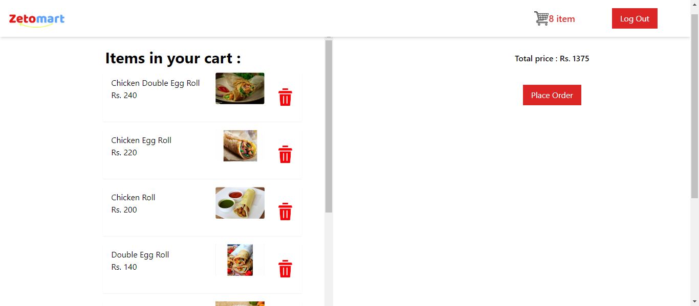

## Zomato clone App

# Please install cors plugin in your chrome browser to see the restaurant list because I integrated the real API of swiggy company.

- Home page
  

- Menu page
  

- Cart page
  
